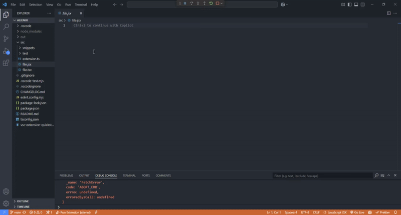

# AlienX – Bringing AlienUI components into your IDE👽

**AlienX** is a powerful VS Code snippet extension crafted by the **AlienUI** team, designed to speed up your React (web) and React Native (app) development with ready-to-use UI components and utility snippets.

## Features

- 🚀 **Pre-built UI Components** – Instantly add `Button`, `Card`, `Input`, `Modal`, and more.
- 🧩 **Supports React & React Native** – Snippets for both React components and React Native elements.
- ⚡ **Multiple Variants** – Easily switch between component variants like `galaxy`, `earth`, and `mars`.
- 🔄 **Fast and Flexible** – Generate full component code blocks in seconds, saving time and reducing boilerplate.
- 🛠️ **Customizable** – Modify snippets to fit your project style with ease.

## Installation

1. Open **VS Code**.
2. Go to **Extensions** (or press `Ctrl+Shift+X`).
3. Search for **AlienX**.
4. Click **Install**.
5. Reload VS Code if necessary.

## Usage

Before usage, make sure you've read AlienUI documentation to see the available component variants. All component varaints available on AlienUI are available on AlienX for both web and app. Check [AlienUI](https://alienui.vercel.app) for documentation.

Simply type the prefix for the snippet you need, and let AlienX do the rest!
The table below shows the available components and their respective prefix.

| **Component**  | **React prefix** | **React JsxOnly prefix** | **React Native prefix** | **React Native JsxOnly prefix** |
| -------------- | ---------------- | ------------------------ | ----------------------- | ------------------------------- |
| `Accordion`    | accordion-web    |                          | accordion-app           |                                 |
| `Alert`        | alert-web        | alert-web-jsx            | alert-app               | alert-app-jsx                   |
| `Avatar`       | avatar-web       | avatar-web-jsx           | avatar-app              | avatar-app-jsx                  |
| `Badge`        | badge-web        | badge-web-jsx            | badge-app               | badge-app-jsx                   |
| `BreadCrumbs`  | breadcrumb-web   | breadcrumb-web-jsx       | breadcrumb-app          | breadcrumb-app-jsx              |
| `Button`       | button-web       | button-web-jsx           | button-app              | button-app-jsx                  |
| `Card`         | card-web         | card-web-jsx             | card-app                | card-app-jsx                    |
| `Carousel`     | carousel-web     |                          | carousel-app            |                                 |
| `Checkbox`     | checkbox-web     | checkbox-web-jsx         | checkbox-app            | checkbox-app-jsx                |
| `Dropdown`     | dropdown-web     |                          | dropdown-app            |                                 |
| `Input`        | input-web        | input-web-jsx            | input-app               | input-app-jsx                   |
| `Modal`        | modal-web        |                          | modal-app               |                                 |
| `Navbar`       | nav-web          |                          |                         |                                 |
| `Pagination`   | pagination-web   | pagination-web-jsx       | pagination-app          | pagination-app-jsx              |
| `Popover`      | popover-web      |                          | popover-app             |                                 |
| `Progress Bar` | progress-web     | progress-web-jsx         | progress-app            | progress-app-jsx                |
| `Spinner`      | spinner-web      | spinner-web-jsx          | spinner-app             | spinner-app-jsx                 |
| `Switch`       | switch-web       |                          | switch-app              |                                 |
| `Tab`          |                  |                          | tab-app                 | tab-app-jsx                     |
| `Table`        | table-web        |                          | table-app               |                                 |
| `Toast`        | toast-web        |                          | toast-app               |                                 |

## Requirements

No additional configuration is required! Once installed, AlienX snippets will be available for `.js`, `.jsx`, `.ts`, and `.tsx` files out of the box.
Just make sure your project has nativewind and tailwindcss installed for React Native and React respectively.

## Compatibility

- **JavaScript** / **TypeScript**
- **React** / **React Native**
- Works seamlessly across any project that uses `.jsx`, `.tsx`, `.js`, or `.ts`.

## Contributing

We welcome contributions from the community!

- **Report bugs** or suggest features via [GitHub Issues](https://github.com/khaymanii/AlienUI/issues).

## License

This project is licensed under the **MIT License** – free to use and modify.

## Release Notes

### 1.0.0

Initial release of **AlienX**

- Added support for React and React Native component snippets.
- Included multiple variants for `Button`, `Card`, `Input` and `Modal`.
- Seamless integration with `.js`, `.jsx`, `.ts`, and `.tsx` files.
- Customizable and easy-to-use snippets with no additional configuration.

## About AlienUI Team

**AlienUI Team** is a modern design and development team focused on creating developer-friendly tools and UI libraries.  
Follow us on [Website](https://alienui.vercel.app) | [Twitter](https://x.com/alienui) | [Linkedin](https://linkedin.com/company/alien-ui) | [GitHub](https://github.com/khaymanii/alienui).

_Developed with ❤️ by the AlienUI Team_
