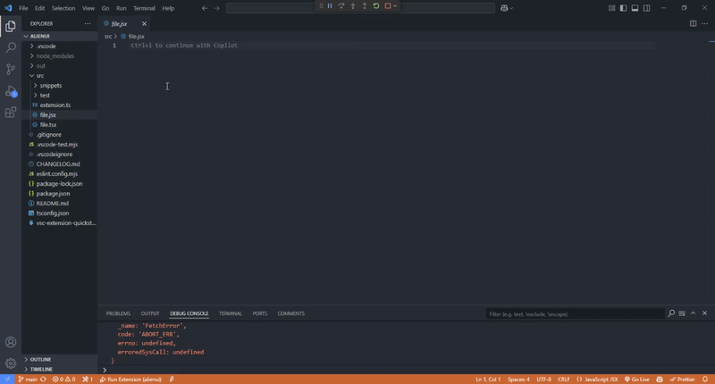

# AlienX – Bringing UI components into your IDE

A powerful VS Code snippet extension crafted by the **AlienUI** team, designed to speed up your web and app development with ready-to-use UI components and utility snippets.

## Features

- Multi-Framework Support – Generate UI snippets for Alien UI, AlienUI React, Daisy UI, Gluestack UI and Material UI in one extension.
- Pre-built UI Components – Instantly add Button, Card, Input, Popover, Table, and more across supported libraries.
- Web & Mobile Ready – Snippets for both web and mobile (React Native) components.
- Multiple Styling Variants – Easily switch between themes like galaxy, earth, and mars (for AlienUI and AlienUI-React) or predefined styles from other UI libraries.
- Flexible & Customizable – Modify generated snippets to match your project’s design system effortlessly.
- Save Time & Reduce Boilerplate – Generate full component structures in seconds for rapid development.
- Component Library Selector – Choose from Alien UI, Alien UI React, Gluestack UI, Daisy UI or Material UI.

## Installation

1. Open **VS Code**.
2. Go to **Extensions** (or press `Ctrl+Shift+X`).
3. Search for **AlienX**.
4. Click **Install**.
5. Reload VS Code if necessary.

## Usage

Before usage, make sure you've read documentation for the supported UI libraries to see the available component and their variants. Check:

- [AlienUI](https://alienui.vercel.app) for AlienUI React Native documentation.
- [AlienUI-React](https://alienui-react.vercel.app) for AlienUI React documentation.
- [DaisyUI](https://daisyui.com) for DaisyUI documentation.
- [GluestackUI](https://gluestack.io) for GluestackUI documentation.
- [MaterialUI](https://mui.com/material-ui) for MaterialUI documentation.

Create a `.tsx` or `.jsx` file in your project folder and Simply type the prefix for the UI snippet you need, and let AlienX do the rest!

The table below shows the available components and their respective prefix.

**Note:** For AlienUI & AlienUI-React component library, All components have both Javascript and Typescript support but Some reusable components have a seperate Javascript and Typescript(tsx) version such as (Accordion, Alert, Button, Dropdown) for better type safety.

| **Component** | **Prefix (AlienUI React)** | **Prefix (AlienUI React Native)** | **Prefix DaisyUI** | **Prefix Gluestack UI** | **Prefix MaterialUI** |
| ------------- | -------------------------- | --------------------------------- | ------------------ | ----------------------- | --------------------- |
| Accordion     | accordion-web              | accordion-app                     | dai-accordion      | glu-accordion           | mui-accordion         |
| Alert         | alert-web                  | alert-app                         | dai-alert          | glu-alert               | mui-alert             |
| Avatar        | avatar-web                 | avatar-app                        | dai-avatar         | glu-avatar              | mui-avatar            |
| Badge         | badge-web                  | badge-app                         | dai-badge          | glu-badge               | mui-badge             |
| BreadCrumbs   | breadcrumb-web             | breadcrumb-app                    | dai-breadcrumb     |                         | mui-breadcrumb        |
| Button        | button-web                 | button-app                        | dai-btn            | glu-btn                 | mui-btn               |
| Card          | card-web                   | card-app                          | dai-card           | glu-card                | mui-card              |
| Carousel      | carousel-web               | carousel-app                      | dai-carousel       |                         |                       |
| Checkbox      | checkbox-web               | checkbox-app                      | dai-checkbox       | glu-checkbox            | mui-checkbox          |
| Dropdown      | dropdown-web               | dropdown-app                      | dai-dropdown       | glu-dropdown            | mui-dropdown          |
| Input         | input-web                  | input-app                         | dai-input          | glu-input               | mui-input             |
| Modal         | modal-web                  | modal-app                         | dai-modal          | glu-modal               | mui-modal             |
| Navbar        | nav-web                    |                                   | dai-nav            |                         |                       |
| Notification  | notification-web           | notification-app                  |                    |                         |                       |
| Pagination    | pagination-web             | pagination-app                    | dai-pagination     |                         | mui-pagination        |
| Popover       | popover-web                | popover-app                       |                    | glu-popover             | mui-popover           |
| Progress Bar  | progress-web               | progress-app                      | dai-progress       | glu-progress            | mui-progress          |
| Search Bar    | search-web                 | search-app                        |                    |                         |                       |
| Spinner       | spinner-web                | spinner-app                       | dai-spinner        | glu-spinner             | mui-spinner           |
| Switch        | switch-web                 | switch-app                        | dai-switch         | glu-switch              | mui-switch            |
| Tab           |                            | tab-app                           | dai-tab            | glu-tab                 | mui-tab               |
| Table         | table-web                  | table-app                         | dai-table          | glu-table               | mui-table             |
| Toast         | toast-web                  | toast-app                         | dai-toast          | glu-toast               |                       |

## Contributing

We welcome contributions from the community!

- **Report bugs** or suggest features via [GitHub Issues](https://github.com/AlienUI-Org/AlienX/issues).

## License

This project is licensed under the **MIT License** – free to use and modify.

## About AlienUI Team

**AlienUI Team** is a modern design and development team focused on creating developer-friendly tools and UI libraries.  
Follow us on [GitHub](https://github.com/AlienUI-Org) | [Twitter](https://x.com/alienui) | [Linkedin](https://linkedin.com/company/alien-ui).

_Developed with ❤️ by the AlienUI Team_
